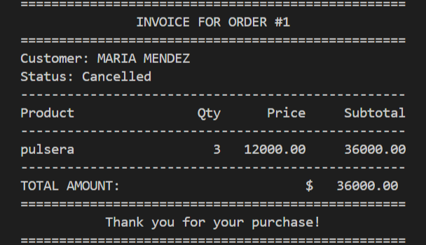
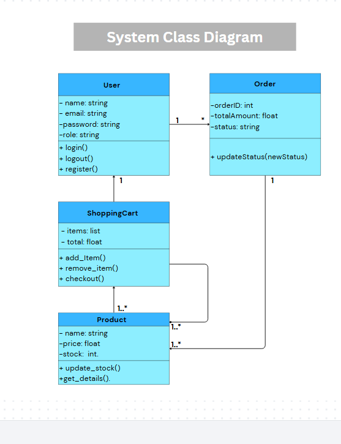

**Virtual Store: Customer Order Management 🛒**

A robust backend solution designed to streamline the process of placing and tracking customer orders, developed as part of my SENA Software Analysis and Development portfolio.

**🚀 Project Scope**

This project focuses on the end-to-end lifecycle of an order:

- **Customer Interaction:** Browse products and manage personal data.
- **Transaction Management:** Place orders and link multiple products to a single sale using a junction table.
- **Professional Reporting:** Automatic generation of business invoices with calculated subtotals.
- **Administrative Control:** View detailed inventory and user records in real-time.

**📸 Visual Preview**

Below is an example of a professional invoice generated by the system using SQL JOINs directly in the terminal. This demonstrates the system's ability to cross-reference data from four different relational tables:
 

**📊 Technical Design**

**Database Design (ERD)**

The following Entity-Relationship Diagram (ERD) illustrates the normalized database structure. It defines the relational schema between users, products, and orders, utilizing a junction table to handle the many-to-many relationship between sales and items:

  

**System Architecture (UML)**

The following UML diagram represents the system's logical architecture and class interactions, ensuring a clear separation of concerns between data persistence, business logic, and the user interface: 

  

**🛠️ Technical Stack**

- **Language:** Python 3.x
- **Database:** SQLite3 (Relational Model)
- **Standards:** IEEE 830 (Requirements) & UML (Architecture)
- **Version Control:** Git & GitHub

**📂 Project Structure**

- **database_design/:** Contains the ERD diagram, UML architecture, and software requirements documentation.
- **database.py:** Initializes the SQLite schema, tables, and relational constraints.
- **view_inventory.py:** Utility to consult existing IDs and stock levels.
- **insert_order.py:** Logic for creating new sales headers in the Order table.
- **insert_order_items.py:** Critical logic for linking multiple products to specific orders.
- **generate_invoice.py:** The "Business Intelligence" module that generates reports using complex SQL queries.
- **main.py:**The central interactive menu that orchestrates the entire application.

**⚙️ Installation and Usage**

**Clone the repository:**

git clone [https://github.com/Yenifer18-4200/invention.git](https://github.com/Yenifer18-4200/invention.git)
cd invention

**Initialize the Database:**
python database.py

**Check Current Data:**
python view_inventory.py 

**Run the Main App:**
python main.py

Developed by Yenifer Mejia - SENA Software Development Student.