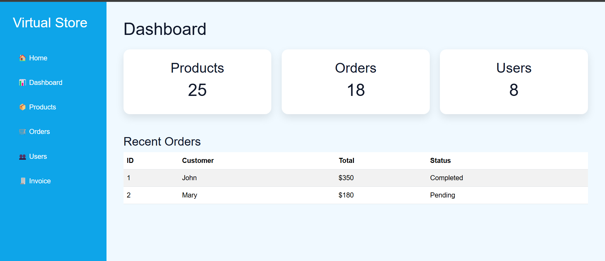
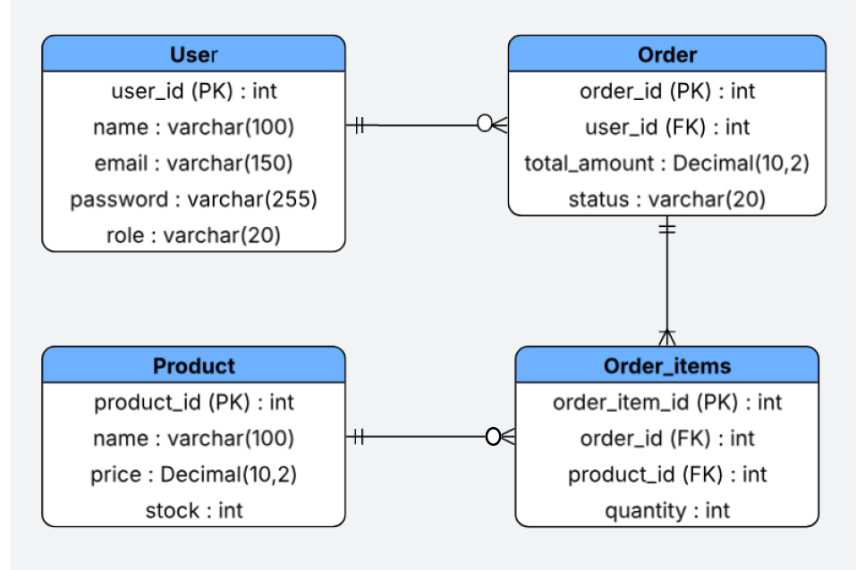

# 🛒 Virtual Store - Customer Order Management & Admin Dashboard

A full-stack web application designed to streamline the process of placing and tracking customer orders, as well as visualizing real-time metrics through a custom admin dashboard. Developed as part of my SENA Software Analysis and Development portfolio[cite: 1].

---

## 🎨 Frontend Overview

The application features a modern, responsive admin dashboard that displays key metrics, order statuses, and system modules.

<p align="center">
  
</p>

### Frontend Modules
* **Dashboard:** Real-time business metrics overview.
* **Products:** Catalog and inventory management interface.
* **Orders:** Purchase history and status tracking.
* **Users:** Customer profile management.
* **Invoices:** Billing and transaction reports.

---

## 🚀 Project Scope & Backend Features

This project focuses on the end-to-end lifecycle of an order:

- **Customer Interaction:** Browse products and manage personal data.
- **Transaction Management:** Place orders and link multiple products to a single sale using a junction table.
- **Professional Reporting:** Automatic generation of business invoices with calculated subtotals.
- **Administrative Control:** View detailed inventory and user records in real-time.

---

## 📸 Visual Preview

Below is an example of a professional invoice generated by the system using SQL JOINs directly in the terminal. This demonstrates the system's ability to cross-reference data from four different relational tables:

<p align="center">
  
</p>

---

## 📊 Technical Design

### Database Design (ERD)

The following Entity-Relationship Diagram (ERD) illustrates the normalized database structure. It defines the relational schema between users, products, and orders, utilizing a junction table to handle the many-to-many relationship between sales and items:

<p align="center">
  
</p>

### System Architecture (UML)
The following UML diagram represents the system's logical architecture and class interactions, ensuring a clear separation of concerns between data persistence, business logic, and the user interface: 

<p align="center">
  
</p>

---

## 🛠️ Technical Stack

- **Backend Framework:** Python 3.x & FastAPI
- **Database:** SQLite3 (Relational Model)
- **Frontend Architecture:** HTML5, Custom CSS3, Jinja2 Templates
- **Standards:** IEEE 830 (Requirements) & UML (Architecture)
- **Version Control:** Git & GitHub

---

## 🚀 Quick Start

1. **Clone the repository:**
   ```bash
   git clone <your-github-repo-url>
   cd invention

## 📂 Project Structure

```text
invention/
│
├── app/
│   ├── routers/          # API Endpoints and business logic
│   ├── schemas.py        # Pydantic models and data validation
│   └── server.py         # FastAPI application entry point
│
├── static/
│   ├── css/
│   │   └── styles.css    # Custom styles for dashboard
│   ├── img/              # Media assets and screenshots
│   └── js/               # Frontend JavaScript modules
│
├── templates/            # HTML Jinja2 Templates (dashboard, products, orders, etc.)
├── database_design/      # ERD diagram, UML architecture, and software requirements
├── database.py           # Initializes the SQLite schema, tables, and relational constraints
├── view_inventory.py     # Utility to consult existing IDs and stock levels
├── insert_order.py       # Logic for creating new sales headers in the Order table
├── insert_order_items.py # Logic for linking multiple products to specific orders
├── generate_invoice.py   # Business Intelligence module for report generation
└── main.py               # Interactive CLI menu for orchestration